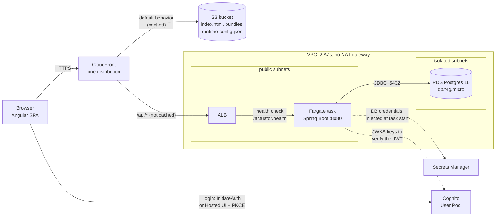

# Angular + Spring Boot + RDS + AWS CDK Sample (Fargate+RDS+VPC+ALB)

<!-- contents -->
**Contents**

- [Implemented cloud concepts](#implemented-cloud-concepts)
- [Theoretical background](#theoretical-background)
  - [Cloud platforms](#cloud-platforms)
  - [Infrastructure as Code (IaC)](#infrastructure-as-code-iac)
- [Architecture](#architecture)
  - [Why use CDK (Infrastructure as Code)?](#why-use-cdk-infrastructure-as-code)
  - [Identity & authentication (Cognito)](#identity--authentication-cognito)
  - [Why Fargate, not EC2](#why-fargate-not-ec2)
  - [Load balancing and scalability](#load-balancing-and-scalability)
  - [CORS: needed locally, not in production](#cors-needed-locally-not-in-production)
  - [Why Fargate + RDS, and what's actually different from the AWS-Lambda-App sample](#why-fargate--rds-and-whats-actually-different-from-the-aws-lambda-app-sample)
  - [Why Spring Boot (over a plain Java app)](#why-spring-boot-over-a-plain-java-app)
  - [RDS Postgres and scalability](#rds-postgres-and-scalability)
  - [Object storage (S3)](#object-storage-s3)
- [CDK Bootstrap](#cdk-bootstrap)
  - ["Compiling" the deployment infrastructure](#compiling-the-deployment-infrastructure)
- [Prerequisites](#prerequisites)
  - [AWS credentials](#aws-credentials)
- [First-time setup: deploy Cognito](#first-time-setup-deploy-cognito)
  - [Create a demo user](#create-a-demo-user)
- [Local development](#local-development)
  - [Optional: full containerized stack (`docker-samples/`)](#optional-full-containerized-stack-docker-samples)
  - [Database migrations (Flyway)](#database-migrations-flyway)
- [Full deploy](#full-deploy)
  - [Wire up the Hosted UI callback for the deployed site](#wire-up-the-hosted-ui-callback-for-the-deployed-site)
- [End-to-end smoke test](#end-to-end-smoke-test)
- [Automated E2E tests (Playwright)](#automated-e2e-tests-playwright)
- [Tear down](#tear-down)
- [Troubleshooting](#troubleshooting)
- [Further reading](#further-reading)
<!-- /contents -->

## Implemented cloud concepts

- **S3** — both `FrontendStack`s (`siteBucket`, blocked public access + OAC)
- **CDN/Edge caching** — CloudFront in both, with S3 + backend (ALB vs HTTP API) as dual origins, `CACHING_OPTIMIZED` vs `CACHING_DISABLED`
- **Lambda** — `AWS-Lambda-App/infra/lib/backend-stack.ts` (Java 17, ARM_64/Graviton)
- **EC2 / Fargate contrast** — this repo's `ApplicationLoadBalancedFargateService` (Fargate, no EC2 management) vs Lambda's zero-server model
- **RDS** — this repo's `DataStack` (Postgres, isolated subnet, Secrets Manager-generated creds)
- **DynamoDB** — Lambda app's `DataStack` (PAY_PER_REQUEST, no VPC needed — fully managed over public API)
- **VPC** — this repo only (public+isolated subnets, no NAT); Lambda app has none, illustrating that DynamoDB doesn't need a VPC
- **ALB** — this repo (`ApplicationLoadBalancedFargateService`)
- **API Gateway** — Lambda app (`HttpApi` + Cognito JWT authorizer at the gateway, contrasted against this repo's in-app `SecurityConfig` check)
- **IAM / Zero-Trust identity** — Cognito User Pools + JWT auth in both; scoped grants (`grantReadData`, custom-resource policy) in Lambda app
- **Secrets Management** — this repo (`ecs.Secret.fromSecretsManager` for DB creds)
- **Custom silicon (Graviton)** — both: `BURSTABLE4_GRAVITON` RDS instance here, `Architecture.ARM_64` Lambda there
- **CDK as IaC** (imperative, TS, compiles to CloudFormation) — the entire `infra/` of both

A minimal reference system with exactly two features: **login** and a **read-only items list** pulled from Postgres.
See `infra/`, `backend/`, `frontend/` for the three pieces, and the design rationale in the plan this was built from.

`AWS-Lambda-App` is the serverless sibling of this project (Lambda + DynamoDB) — same product, same frontend, deliberately different backend architecture so the two can be compared directly.

## Theoretical background

### Cloud platforms

- **AWS** (~31% market share)
  - Deepest service catalog and largest ecosystem.
  - First-mover advantage in serverless (Lambda, DynamoDB).
  - Strong custom silicon (Graviton CPUs) for a cost-performance edge.
- **Microsoft Azure** (~23–25% share)
  - Easy integration with widely-used Microsoft corporate solutions (Active Directory, M365 accounts/passwords/permissions).
  - Dominant in hybrid cloud via Azure Arc (connect and manage your own servers from Azure's control panel).
  - First-party OpenAI integration and the Copilot ecosystem (using AI models at scale within company privacy boundaries).
- **Google Cloud (GCP)** (~11–12% share)
  - Best-in-class managed Kubernetes (Google's own technology — zero-management, no VM instances, pay-by-usage if you containerize this way).
  - Superior big data / real-time analytics (BigQuery — SQL queries over enormous datasets in seconds).
  - Advanced AI infrastructure (Vertex AI, custom TPUs).

This project uses AWS.
The choice of Cognito/RDS/ECS/S3+CloudFront throughout reflects AWS-specific services, not a cloud-agnostic design.

### Infrastructure as Code (IaC)

The general shift this project follows: from manual web-console clicking to version-controlled software practices for defining infrastructure.

|                 | Multi-cloud / ecosystem | Cloud-native |
|-----------------|--------------------------|---------------|
| **Declarative** (DSL) | Terraform (HCL) | CloudFormation (YAML/JSON) |
| **Programming languages** (imperative) | Pulumi (TS, Python, Go) | **AWS CDK** (TS, Python, Java, ... — compiles to CloudFormation) |

> [!NOTE]
> This project sits in the bottom-right cell: AWS CDK, cloud-native and imperative.
> See "Why use CDK" below for what that trade-off actually buys you.

#### How IaC tools actually deploy

None of the three tools compiles to anything that runs inside the cloud.
Each one works out the list of resources you want and then has the cloud's API create them.
The difference is *who* makes those API calls:

- **Terraform / Pulumi** (client-side): your machine calls each service API directly (`s3:CreateBucket`, `ecs:CreateService`, ...) and tracks the result in a state file.
- **AWS CDK** (server-side): `cdk synth` produces a CloudFormation template (`infra/cdk.out/`), and `cdk deploy` uploads it and calls only the CloudFormation API.
  - The CloudFormation service then calls the individual service APIs from inside AWS, keeps the state in the stack, and rolls back automatically on failure.

#### What "multi-cloud" actually means

> [!WARNING]
> "Multi-cloud" means one tool and one workflow with many providers.
> It does not mean one piece of code that runs on every cloud.
> A provider is a plugin that knows one cloud's API, and resources stay cloud-specific (Terraform's `aws_s3_bucket` vs `google_storage_bucket`).

#### Is there a universal, Liquibase-style layer?

Mostly no, and the reason is useful to know.
Liquibase works because SQL databases share one concept (tables, columns, indexes), so `createTable` can be translated into each dialect (database engine).
Cloud services don't line up like that.
AWS IAM and GCP IAM work differently, and so do VPCs, and Fargate vs. Cloud Run vs. Azure Container Apps.
The closest portable layers are Kubernetes (portable runtime), Crossplane or your own modules (one interface over per-cloud implementations), and Dapr (app-level APIs). Each one costs you some cloud-specific features.

## Architecture



The browser talks to two places only: **Cognito**, to log in and get a JWT, and **CloudFront**, for everything else.
CloudFront serves the Angular files from S3 and forwards `/api/*` to the ALB, so the frontend and the API share one origin and no CORS is needed in production.
Every API call carries the JWT as a `Bearer` header, and **Spring Security inside the app** validates it (signature, issuer, `client_id`); the ALB just passes it through.

> [!NOTE]
> The Fargate tasks sit in *public* subnets with a public IP because the VPC has no NAT gateway: they need outbound internet to pull the image and reach Cognito and Secrets Manager.
> They only accept traffic from the ALB, and only the tasks can reach RDS in the isolated subnets on port 5432.

| Stack | Main resources | What it does here |
|---|---|---|
| **FargateAuthStack** | Cognito User Pool, app client, Hosted UI domain `items-fargate-app` | Users, login flows, issuing JWTs. Self-signup is off. |
| **FargateDataStack** | VPC (2 AZs, public + isolated subnets, 0 NAT), RDS Postgres 16 `db.t4g.micro` (Graviton), generated secret | Network boundary and the database. Schema and seed data come from Flyway at backend startup, not from CDK. |
| **FargateBackendStack** | ECS cluster, `ApplicationLoadBalancedFargateService` (1 task, 0.25 vCPU / 512 MB), public ALB | Builds `backend/Dockerfile` during `cdk deploy`, runs it, health-checks `/actuator/health`, opens port 5432 on the DB security group. |
| **FargateFrontendStack** | Private S3 bucket (OAC), CloudFront distribution, 3 `BucketDeployment`s | Hosts the SPA, routes `/api/*` to the ALB, rewrites 403/404 to `index.html`, writes `runtime-config.json` from live CDK values. |

**Code layout:**

- **infra/** — AWS CDK (TypeScript), 4 stacks: `FargateAuthStack` (Cognito), `FargateDataStack` (VPC + RDS Postgres), `FargateBackendStack` (ECS+Fargate behind an ALB), `FargateFrontendStack` (S3 + CloudFront).
  - In CDK terms, `backend-stack.ts` doesn't wire the ALB and ECS service up as two separate pieces.
  - It uses `aws-ecs-patterns`' `ApplicationLoadBalancedFargateService`, a single high-level construct that provisions both together (the ALB, its listener/target group, the ECS service, and the Fargate task definition) with sensible defaults, rather than wiring each piece by hand.
- **backend/** — Spring Boot (Java 17, Maven). One endpoint: `GET /api/items`, secured as an OAuth2 resource server validating Cognito-issued JWTs.
- **frontend/** — Angular 18 (standalone components). Two login paths converging on one auth state:
  - **Default**: a plain email/password form calling Cognito's `InitiateAuth` API directly.
  - **Secondary**: "Sign in with Hosted UI", redirecting to Cognito's hosted login page (Authorization Code + PKCE).

No signup UI exists on purpose — create a demo user manually (below).

### Why use CDK (Infrastructure as Code)?

> [!TIP]
> Rather than clicking through the AWS Console, this project's infrastructure is defined as TypeScript code (`infra/`). That gets you:
>
> - Standard programming constructs — loops, conditionals, variables, functions, unit tests, and shareable packages — applied to infrastructure, instead of hand-repeating console steps or fighting a templating language.
> - A reproducible environment:
>   - The same code deploys an identical stack every time.
>   - A bad manual click in the Console (or a bad deploy) is undone by just deploying the previous, known-good code again.

### Identity & authentication (Cognito)

`FargateAuthStack` uses Amazon Cognito for identity: sign-up/login, social/OAuth-OIDC logins, and JWT token issuance, so this project doesn't build a custom user-auth backend from scratch.
Cognito provides the secure user database, token generation, and multi-step auth flows.
But it doesn't remove the two integration responsibilities either side of it still has:

- The frontend must still follow the actual login procedure (this project's two paths: direct `InitiateAuth` calls, or the Hosted UI's Authorization Code + PKCE redirect).
- The backend must still validate every incoming token itself (`SecurityConfig`'s `JwtDecoder`, checking signature, issuer, and — since Cognito access tokens carry `client_id` rather than a standard `aud` claim — a custom validator for that too).

### Why Fargate, not EC2

`FargateBackendStack` runs on ECS+Fargate rather than ECS+EC2. Two separate layers are involved:

- **Orchestration layer — Amazon ECS**: AWS-native container orchestration (scheduling, health checks, rolling deploys).
  - This layer is the same either way; only the compute layer underneath it changes.
- **Compute layer — EC2 vs Fargate**:
  - **ECS+EC2** (IaaS)
    - ECS schedules containers onto EC2 instances you provision.
    - You patch and pay for them regardless of utilization.
    - Full OS with root access.
    - More control (custom AMIs, GPU instances, Spot pricing).
    - More to manage.
  - **ECS+Fargate** (serverless, used here)
    - AWS runs the containers on infrastructure you never see.
    - You declare CPU/memory per task, and that's the whole compute footprint.
    - Zero management, no servers to patch or scale.
    - No OS access.

Other ways to run containers on AWS, for comparison:

- **App Runner** — simplest: point it at an image, it builds/deploys/scales for you, less configurable.
- **Elastic Beanstalk** — older Docker-on-EC2 PaaS wrapper.
- **EKS** — real Kubernetes, on EC2 or Fargate nodes.
- **Lambda with container-image packaging** — event-driven, cold starts, 15-minute execution cap; the deliberate second-iteration comparison point for this project.
- **Lightsail Containers** — fixed-price, minimal-flexibility option for small apps.

> [!IMPORTANT]
> Fargate was chosen here so a normal long-running Spring Boot process (same JDBC connection pool behavior as running it anywhere else) doesn't come with the ongoing burden of managing EC2 instances for what's meant to be a minimal reference app.

### Load balancing and scalability

- **ALB (Application Load Balancer)** — the single, stable entry point (one DNS name) that clients actually hit.
  - It continuously health-checks the running tasks and always knows the current healthy set, routing traffic only to those.
  - A task that's still starting up, crashed, or failing its health check gets excluded automatically until it recovers.
- **ECS** — runs one or more service tasks (each an instance of the container) that come and go as they scale, redeploy, or get replaced after a health-check failure.
  - Task IPs aren't stable, so the ALB is what gives clients one address that keeps working regardless of what's happening behind it.

### CORS: needed locally, not in production

> [!TIP]
> - **Production**: CloudFront fronts both the frontend (S3) and backend (`/api/*` routed to the ALB) as behaviors on one distribution (`frontend-stack.ts`) — to the browser it's a single origin, so no CORS preflight ever happens. `CorsConfig.java` documents this explicitly.
> - **Local dev**: the frontend (`localhost:4200`) and backend (`localhost:8080`) *are* different origins, so CORS is genuinely needed there — but only under the `local` Spring profile (`CorsConfig`, `@Profile("local")`). See `CLAUDE.md`'s "Backend CORS" section for a filter-chain-ordering gotcha this hit (a standalone `CorsFilter` bean runs after Spring Security's chain, so it must instead be wired in as a `CorsConfigurationSource` via `SecurityConfig`'s `.cors(...)`).

### Why Fargate + RDS, and what's actually different from the AWS-Lambda-App sample

The frontend and the Cognito setup are unchanged.
What changed is everything to do with running the backend and storing data:

| | This sample | AWS-Lambda-App sample |
|---|---|---|
| Compute | Long-running Spring Boot process on ECS Fargate | Java Lambda, invoked per-request by API Gateway |
| Data store | RDS Postgres (fixed hourly cost, always on) | DynamoDB, on-demand billing (near-zero cost idle) |
| JWT validation | Spring Security `SecurityConfig` + a custom `CognitoClientIdValidator`, inside the app | API Gateway's `HttpUserPoolAuthorizer`, before the Lambda ever runs |
| Schema/seed data | Flyway migrations (`V1__create_items_table.sql`, `V2__seed_items.sql`) | A CDK `AwsCustomResource` that seeds the table once on stack creation — DynamoDB has no migration tool equivalent to Flyway |
| Local dev of the backend | `mvn spring-boot:run` — a real local server you can hit, breakpoint, and iterate on in seconds | **No local emulator.** The backend must be deployed to be tested at all; local frontend dev talks to the real, deployed API Gateway |
| Framework | Spring Boot (fast to write, adds classpath scanning + context startup cost) | Plain `RequestHandler` + AWS SDK v2 (more boilerplate, no Spring cold-start tax) |

The "local dev of the backend" row is the headline advantage this sample has over the Lambda one — `mvn spring-boot:run` gives an instant local restart you can hit and breakpoint, versus the Lambda sample's requirement to `mvn package` + `cdk deploy LambdaBackendStack` before every change is testable at all.

### Why Spring Boot (over a plain Java app)

> [!IMPORTANT]
> The AWS-Lambda-App sample deliberately avoids Spring Boot (see its "Why not Spring Boot on Lambda" section) because classpath scanning and `ApplicationContext` startup add hundreds of milliseconds to *every* Lambda cold start.
> That cost doesn't apply here: on ECS+Fargate, the container starts once per task lifetime, not once per request — the startup cost is paid a single time, then amortized over however long the task keeps running.

With that cost effectively removed, Spring Boot's productivity trade-offs tip the other way:

- Auto-configuration and dependency injection replace hand-wired object graphs.
- Spring Data JPA turns `ItemRepository` into a working repository from an interface alone, no boilerplate CRUD code.
- Spring Security's OAuth2 resource server support handles JWT validation declaratively (`SecurityConfig`), rather than hand-rolling token parsing and verification.
- An embedded Tomcat server and Actuator health endpoint come for free, rather than being assembled by hand.

> [!NOTE]
> A plain `RequestHandler` (this project's Lambda sibling's approach) makes sense specifically because Lambda's per-invocation billing and cold-start sensitivity make every millisecond of framework overhead visible and costly.
> A long-running Fargate task never pays that overhead more than once, so there's no equivalent pressure to avoid Spring Boot here.

### RDS Postgres and scalability

`FargateDataStack` provisions RDS Postgres — a managed instance of real, standard Postgres, but still bound by Postgres's fundamental architecture: one primary instance handles all writes.
Read replicas scale reads horizontally; writes don't scale past that single primary.

If you need real horizontal scaling of a relational-shaped workload, AWS's answer is usually **Aurora PostgreSQL** — a different, AWS-built engine that's Postgres-compatible, with separated compute/storage and better replica scaling.
The alternative considered for this project's `items` table was **DynamoDB**, which scales writes horizontally with no single-primary bottleneck, at the cost of giving up SQL joins/ad-hoc querying.
Neither matters at this project's scale (`db.t4g.micro`, 8 seed rows) — it's a design question only if this stopped being a reference app.

### Object storage (S3)

`FargateFrontendStack` uses S3 (Simple Storage Service) to host the built Angular app: unstructured data storage — here, static website files — accessible over an HTTP API.
Buckets provide virtually infinite scalability and extreme durability (typically 99.999999999%, "11 nines") by replicating objects across multiple facilities automatically.
In this project, S3 never serves traffic directly (`blockPublicAccess: BLOCK_ALL`) — CloudFront sits in front of it as the actual public entry point, covered next.

## CDK Bootstrap

`cdk bootstrap` sets up the initial deployment infrastructure — a `CDKToolkit` CloudFormation stack (an S3 bucket for assets, an ECR repo, IAM roles).
It's the small, one-time piece of AWS infrastructure CDK itself needs in order to deploy the rest of your desired infrastructure.

> [!WARNING]
> **Never delete `CDKToolkit` intentionally:**
> - **S3 bucket takeover risk**
>   - If you delete its asset bucket, an attacker who knows your account ID and region could register that exact bucket name in their own account.
>   - If you later run `cdk deploy` without re-bootstrapping, your pipeline could try to publish deployment assets (e.g. Lambda code) straight into the attacker's bucket.
> - **Loss of asset history**
>   - That bucket holds zipped versions of previously deployed Lambda functions and CloudFormation templates.
>   - Deleting it wipes out that history, making rollback or inspecting older builds harder.
>
> For production, protect it with `cdk bootstrap --termination-protection`.

### "Compiling" the deployment infrastructure

- `cdk synth` — runs your TypeScript through `ts-node` (so real TypeScript type errors do get caught here) and turns the CDK constructs into raw CloudFormation JSON.
  - This is the closest thing to "compile." No AWS calls.
- `cdk diff` — also synthesizes, then asks CloudFormation to compute a change set against what's currently deployed.
  - This *does* talk to AWS, so it catches more (e.g. schema-level template validation).

> [!WARNING]
> Neither one guarantees a successful deploy. AWS-side limits aren't coverable by CloudFormation's template schema, and only surface at actual deploy time:
> - Reserved words / naming rules
> - One-resource-per-parent constraints
> - Account/region quotas
> - Region-specific service or instance-type availability
> - IAM permission boundaries
>
> Nor do they guarantee your *application's* runtime behavior is correct (e.g. CORS) — that's invisible to CDK at every stage, since it lives inside the running code, not the infrastructure.
> Both categories are only knowable by deploying and exercising the running system for real.

## Prerequisites

> [!NOTE]
> Node 20+, npm, JDK 17, Maven, Docker Desktop, an AWS account + credentials configured (`aws configure`).
> The AWS CDK CLI does **not** need to be installed globally — `infra/package.json` scripts run it via `npx`.

### AWS credentials

If you don't already have an IAM user to deploy with, create one and generate an access key:

```bash
aws iam create-user --user-name aws-sample-app-deployer
aws iam attach-user-policy --user-name aws-sample-app-deployer --policy-arn arn:aws:iam::aws:policy/AdministratorAccess
aws iam create-access-key --user-name aws-sample-app-deployer
```

> [!WARNING]
> `AdministratorAccess` is the simplest policy that lets CDK deploy everything, but it gives this user full control of the
> account. Use it only in a personal sandbox account, and delete the access key (or the user) when you're done.

> [!IMPORTANT]
> The last command prints an `AccessKeyId`/`SecretAccessKey` pair exactly once — copy both immediately.

Then configure a named CLI profile with them:

```bash
aws configure --profile aws-app-sample
# AWS Access Key ID [None]: <paste it>
# AWS Secret Access Key [None]: <paste it>
# Default region name [None]: eu-central-1
# Default output format [None]: json
```

Every AWS/CDK command below assumes this profile is active for the session:

```bash
export AWS_PROFILE=aws-app-sample        # bash
$env:AWS_PROFILE = "aws-app-sample"      # PowerShell
```

## First-time setup: deploy Cognito

Local development still needs a *real* Cognito User Pool (there's no local emulator here), so deploy just `FargateAuthStack` first:

```bash
cd infra
npm install
npx cdk bootstrap   # once per AWS account/region
npx cdk deploy FargateAuthStack
```

Note the `UserPoolId`, `UserPoolClientId`, `CognitoDomain`, and `IssuerUri` outputs.

### Create a demo user

Self-signup is disabled (no signup feature exists). Create one user manually:

```bash
aws cognito-idp admin-create-user \
  --user-pool-id <UserPoolId> \
  --username demo@example.com \
  --user-attributes Name=email,Value=demo@example.com Name=email_verified,Value=true \
  --message-action SUPPRESS

aws cognito-idp admin-set-user-password \
  --user-pool-id <UserPoolId> \
  --username demo@example.com \
  --password 'YourPassword123!' \
  --permanent
```

## Local development

1. **Database**: `docker-compose up -d` (Postgres on `localhost:5432`).
2. **Backend**:
   ```bash
   cd backend
   export COGNITO_ISSUER_URI=<IssuerUri from AuthStack>
   export COGNITO_APP_CLIENT_ID=<UserPoolClientId from AuthStack>
   mvn spring-boot:run -Dspring-boot.run.profiles=local
   ```
   Flyway migrates the schema and seeds sample items automatically.
   CORS for `localhost:4200` is enabled only in this profile.
3. **Frontend**: edit `frontend/public/runtime-config.json` with the real values from `FargateAuthStack`'s outputs:
   ```json
   {
     "cognitoUserPoolId": "<UserPoolId>",
     "cognitoClientId": "<UserPoolClientId>",
     "cognitoDomain": "<CognitoDomain>",
     "region": "<region>",
     "apiBaseUrl": "http://localhost:8080/api"
   }
   ```
   Then:
   ```bash
   cd frontend
   npm start
   ```
   Visit `http://localhost:4200`, log in with the demo user via either path, and confirm the items list loads.

### Optional: full containerized stack (`docker-samples/`)

`docker-samples/` is a reference-only sample, not part of the setup above and not wired into `infra/` or CDK in any way. It's an alternative to running the database, backend, and frontend as three separate local processes (steps 1–3 above): one `docker compose up` builds and runs all three together. It also demonstrates common Dockerfile/Compose concepts (multi-stage builds, BuildKit cache mounts, non-root users, `HEALTHCHECK`, etc.):

- `docker-samples/backend/Dockerfile` — an alternate to `backend/Dockerfile` (the one CDK's `ContainerImage.fromAsset('../backend')` actually builds and deploys to Fargate). Same runtime output, more concepts demonstrated.
- `docker-samples/frontend/Dockerfile` + `nginx.conf` — containerizes the Angular app behind nginx. The real deployed frontend is a static S3 + CloudFront site (`FargateFrontendStack`), never a container — this is purely illustrative of the alternative.
- `docker-samples/docker-compose.yml` — builds and runs Postgres + both images together. Build contexts point back at the repo root, since the sample Dockerfiles need the real `backend/`/`frontend/` source trees.

To run it (from the repo root, with `COGNITO_ISSUER_URI`/`COGNITO_APP_CLIENT_ID` set as in step 2 above):

```bash
docker compose -f docker-samples/docker-compose.yml up --build
```

### Database migrations (Flyway)

Schema and seed data are managed by Flyway (`backend/src/main/resources/db/migration/`), not by Hibernate auto-DDL:

- `V1__create_items_table.sql` — creates the `items` table.
- `V2__seed_items.sql` — inserts the 8 sample rows the items page displays.

> [!NOTE]
> On every backend startup, Flyway compares these files against a `flyway_schema_history` table it maintains in Postgres.
> Migrations already recorded there are skipped; any new, higher-numbered file gets executed once, in order.
> Editing an already-applied migration file causes a checksum mismatch and a startup failure by design — add a new `V3__...sql` for further schema/data changes instead of editing `V1`/`V2`.
>
> `spring.jpa.hibernate.ddl-auto=validate` (in `application.yml`) keeps Hibernate from generating or altering schema itself.
> It only validates that the `Item` entity matches what Flyway already created. Flyway is the single owner of schema state.

## Full deploy

```bash
cd infra
npx cdk synth        # fast correctness check, no AWS calls
npx cdk diff
npx cdk deploy --all
```

> [!WARNING]
> First deploy takes ~10-20 minutes (RDS provisioning + Fargate stabilization). Note the `FargateFrontendStack` `SiteUrl` output.

### Wire up the Hosted UI callback for the deployed site

`FargateAuthStack` only allowlists `localhost` callback/logout URLs until it knows the CloudFront domain. Re-deploy it once you have `SiteUrl`:

```bash
export CLOUDFRONT_CALLBACK_URL="https://<your-cloudfront-domain>/callback"
export CLOUDFRONT_LOGOUT_URL="https://<your-cloudfront-domain>/login"
npx cdk deploy FargateAuthStack
```

> [!NOTE]
> The production `runtime-config.json` is written automatically by `FargateFrontendStack` from live CDK values — no manual edit needed there.

## End-to-end smoke test

1. Visit `SiteUrl` unauthenticated — should redirect to `/login`.
2. Log in with the demo user via the default form — items list should load.
3. Log out, log in again via "Sign in with Hosted UI" — same items list should load (confirms both paths converge).
4. Refresh directly on `/items` — should still work (confirms the CloudFront 404→`index.html` SPA rewrite).

## Automated E2E tests (Playwright)

`e2e/` drives the *real* stack through an actual browser — no mocks — covering the same scenarios as the manual smoke test above (the login guard, the default form, logout, and the Hosted UI/PKCE path converging on the same items list).

**Prerequisites**: the full local stack running (`docker-compose up -d`, the backend, and `ng serve` — see "Local development" above), plus a demo user's credentials.

```bash
cd e2e
npm install
npx playwright install chromium   # one-time browser download
cp .env.example .env              # fill in DEMO_USER_EMAIL / DEMO_USER_PASSWORD
npm test
```

> [!TIP]
> To run against a deployed CloudFront site instead of local dev, set `BASE_URL` (e.g. in `.env`) to the `SiteUrl` output.

## Tear down

> [!WARNING]
> **The deployed stack costs money for as long as it exists**, even with no traffic: the RDS instance, the ALB and the
> Fargate task are billed per hour, and so are their public IPv4 addresses. Destroy the stacks when you're done.

```bash
cd infra
npx cdk destroy --all
```

This deletes `FargateFrontendStack`, `FargateBackendStack`, `FargateDataStack` and `FargateAuthStack`. Their resources use
`RemovalPolicy.DESTROY`, so the RDS database (no final snapshot), the S3 site bucket (emptied automatically) and the Cognito
user pool are removed too, along with all data in them.

What stays:
- **`CDKToolkit`** (from `cdk bootstrap`): keep it, see [CDK Bootstrap](#cdk-bootstrap). Its ECR repository still holds the
  backend image built during deploy, which costs a little storage.
- Anything CDK doesn't delete by default, such as CloudWatch log groups. Check Secrets Manager and CloudWatch Logs in the
  console if you want the account fully clean.

## Troubleshooting

| Symptom | Fix |
|---|---|
| Backend fails on startup or on the first API call with `PKIX path building failed` (or `mvn` can't download dependencies) | An antivirus or proxy is intercepting HTTPS with its own root CA, which the JDK doesn't trust. Import that CA into a *copy* of `cacerts` and pass it to the app's JVM with `-Dspring-boot.run.jvmArguments="-Djavax.net.ssl.trustStore=... -Djavax.net.ssl.trustStorePassword=changeit"`. `MAVEN_OPTS` only affects Maven's own JVM, not the forked app. Full steps in `CLAUDE.md`. |
| Browser shows a CORS error locally, the preflight `OPTIONS` gets 401 | Run the backend with `-Dspring-boot.run.profiles=local`. If it still fails, check that `CorsConfig` is exposed as a `CorsConfigurationSource` and wired through `SecurityConfig`'s `.cors(...)`. A standalone `CorsFilter` runs after Spring Security, too late for the preflight. |
| `401` from `/api/items` while logged in | `COGNITO_ISSUER_URI` and `COGNITO_APP_CLIENT_ID` must match the User Pool and app client the frontend logs in to (`runtime-config.json`). A token from another pool or client fails the issuer or `client_id` check. |
| Backend won't start: Flyway `Validate failed` / checksum mismatch | An already-applied migration was edited. Revert it and add a new `V3__...sql`. Locally you can also reset the database with `docker-compose down -v`. |
| `cdk deploy FargateBackendStack` fails while building the image | Docker Desktop must be running: CDK builds `backend/Dockerfile` locally during deploy. |
| Deploy hangs on the ECS service, tasks keep restarting | Check the task's logs in CloudWatch (ECS console → service → task → Logs). Usual causes: wrong Cognito env vars or DB credentials, or the app needing longer than the 150 s health-check grace period to come up. |
| Hosted UI shows `redirect_mismatch` on the deployed site | `FargateAuthStack` still only allows `localhost` callbacks. Re-deploy it with `CLOUDFRONT_CALLBACK_URL` / `CLOUDFRONT_LOGOUT_URL` set ([Wire up the Hosted UI callback](#wire-up-the-hosted-ui-callback-for-the-deployed-site)). |
| Old frontend still shows after a deploy | `index.html` and `runtime-config.json` are sent with `no-cache` and invalidated on deploy. A hard refresh (Ctrl+F5) clears what the browser still holds. |
| AWS CLI / CDK: `ExpiredToken` or `Unable to locate credentials` | Set the profile for the session: `export AWS_PROFILE=aws-app-sample` (bash) or `$env:AWS_PROFILE = "aws-app-sample"` (PowerShell). |
| Playwright: `net::ERR_NETWORK_ACCESS_DENIED` | Not a TLS problem, so `ignoreHTTPSErrors` won't help. A firewall or antivirus is blocking the freshly downloaded Chromium: allow `chrome.exe` under `%LOCALAPPDATA%\ms-playwright\`. |
| E2E tests don't see `DEMO_USER_EMAIL` / `DEMO_USER_PASSWORD` | Run them with `npm test`, which loads `.env` through `node --env-file`. Plain `npx playwright test` skips it. |
| A Hosted UI locator matches two elements | Cognito renders hidden duplicates of the form for mobile. Scope the locator with `:visible`. |

---

## Further reading

- AWS CDK: [Developer guide](https://docs.aws.amazon.com/cdk/v2/guide/home.html) · [Bootstrapping](https://docs.aws.amazon.com/cdk/v2/guide/bootstrapping.html) · [`aws-ecs-patterns`](https://docs.aws.amazon.com/cdk/api/v2/docs/aws-cdk-lib.aws_ecs_patterns-readme.html) · [CDK API reference](https://docs.aws.amazon.com/cdk/api/v2/)
- Compute and networking: [Amazon ECS on Fargate](https://docs.aws.amazon.com/AmazonECS/latest/developerguide/AWS_Fargate.html) · [Application Load Balancers](https://docs.aws.amazon.com/elasticloadbalancing/latest/application/introduction.html) · [VPC subnets](https://docs.aws.amazon.com/vpc/latest/userguide/configure-subnets.html) · [Passing Secrets Manager secrets to ECS](https://docs.aws.amazon.com/AmazonECS/latest/developerguide/secrets-envvar-secrets-manager.html)
- Data: [Amazon RDS for PostgreSQL](https://docs.aws.amazon.com/AmazonRDS/latest/UserGuide/CHAP_PostgreSQL.html) · [Flyway documentation](https://documentation.red-gate.com/flyway)
- Frontend delivery: [CloudFront with an S3 origin (OAC)](https://docs.aws.amazon.com/AmazonCloudFront/latest/DeveloperGuide/private-content-restricting-access-to-s3.html) · [CloudFront cache behaviors](https://docs.aws.amazon.com/AmazonCloudFront/latest/DeveloperGuide/distribution-web-values-specify.html)
- Identity: [Cognito User Pools](https://docs.aws.amazon.com/cognito/latest/developerguide/cognito-user-pools.html) · [Verifying Cognito JWTs](https://docs.aws.amazon.com/cognito/latest/developerguide/amazon-cognito-user-pools-using-tokens-verifying-a-jwt.html) · [OAuth 2.0 PKCE (RFC 7636)](https://datatracker.ietf.org/doc/html/rfc7636)
- Spring: [Spring Security OAuth2 Resource Server (JWT)](https://docs.spring.io/spring-security/reference/servlet/oauth2/resource-server/jwt.html) · [Spring Security CORS](https://docs.spring.io/spring-security/reference/servlet/integrations/cors.html) · [Spring Boot Actuator](https://docs.spring.io/spring-boot/reference/actuator/index.html)
- Testing: [Playwright](https://playwright.dev/docs/intro)
- Sibling project: `AWS-Lambda-App`, the same app on Lambda + API Gateway + DynamoDB
